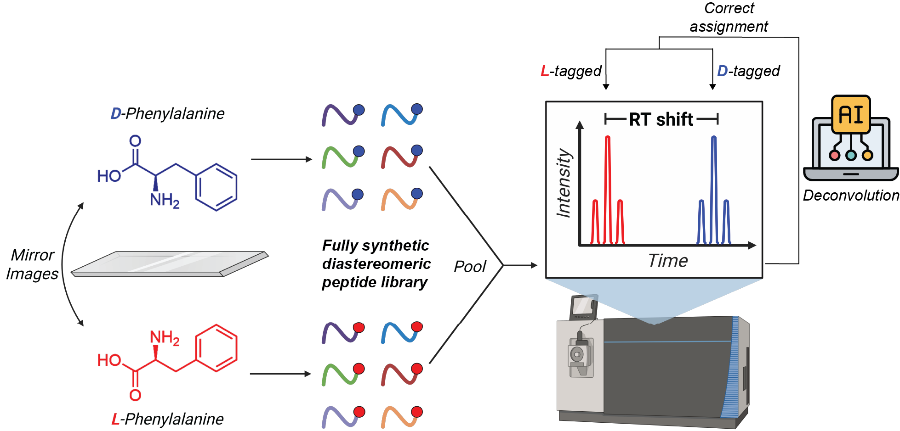
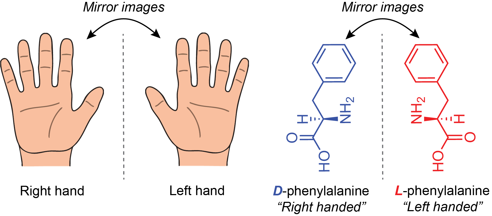

<p align="center"></p>

---

[](https://opensource.org/licenses/MIT)
[](https://huggingface.co/datasets/amirka20/StereoPep)

[**arXiv Preprint**](https://arxiv.org/abs/PLACEHOLDER) | [**HuggingFace Dataset**](https://huggingface.co/datasets/amirka20/StereoPep) | [**GitHub**](https://github.com/amirika20/StereoPep-Benchmarks) | [**Dataset Curation**](https://github.com/amirika20/StereoPep-Curation)

# StereoPep-Benchmarks

A comprehensive benchmarking suite for **peptide retention-time (RT) prediction**, with a central focus on **stereoisomer discrimination** — whether existing ML models can distinguish D-amino acids from their L-amino acid counterparts (specifically D-Phe `f` vs L-Phe `F`).

---

## What Are Stereoisomers?

**Stereoisomers** are molecules that share the same molecular formula and the same sequence of bonded elements, but differ in the three-dimensional orientation of their atoms. This distinction arises at **chirality centers** — carbon atoms bonded to four different substituents — where the spatial arrangement can produce non-superimposable mirror images.

<p align="center"></p>

The two mirror-image forms are called **enantiomers** (L- and D-). When a molecule has multiple chirality centers and the configurations differ at only some of them, the resulting isomers are called **diastereomers**. Unlike constitutional isomers, stereoisomers have identical connectivity, making them very difficult for sequence-based models to distinguish.

In the context of peptides, **L-amino acids** are the natural, biologically dominant form, while **D-amino acids** are their mirror-image counterparts. Despite having the same sequence string (e.g., the same SMILES graph topology), D- and L-amino acid residues interact differently with chromatographic columns, producing distinct **retention times** in LC-MS/MS experiments. This benchmark tests whether ML models can detect that difference.

---

## Datasets

### StereoPep (`stereopep-ano/StereoPep` on HuggingFace)

A custom dataset with a normalized retention-time target `B` (0–100 scale). Loaded via `datasets.load_dataset("stereopep-ano/StereoPep", ...)`.

| Split | Description |
|---|---|
| `stereopep` | Main train / val / test splits |
| `diastereomer_pairs` | Matched pairs `(seq_f, seq_F)` — same peptide with D-Phe vs L-Phe; `delta_B = B_f - B_F` |
| `diastereomer_pairs_trainval` | Same stereo pairs drawn from train/val sequences |
| `terminal_tag_pairs` | Pairs differing by an N-terminal tag addition |
| `point_mutant_pairs` | Pairs differing by a single amino-acid point substitution |

### DIA (local)

A large LC-MS/MS DIA proteomics dataset stored in `data/`:

| File | Rows |
|---|---|
| `data/dia_train.txt` | ~102,600 |
| `data/dia_val.txt` | ~22,000 |
| `data/dia_test.txt` | ~22,000 |

Tab-separated format: `sequence` + `RT` (raw retention time in seconds). No stereoisomer pairs.

---

## Model Zoo

The same set of models is benchmarked on both datasets. Each model is run with 10 random seeds.

| Model | Script | Architecture |
|---|---|---|
| **GIN** | `gin_scratch.py` | Graph Isomorphism Network (Hu et al., ICLR 2020) from random init; SMILES via RDKit |
| **Pretrained GIN** | `pretrained_gin.py` | Same GIN loaded from a pretrained molecular checkpoint |
| **DeepLC** | `deeplc.py` | CNN ensemble (Bouwmeester et al., 2021); 3 models with kernel sizes 2/4/8; 4 parallel paths: atom counts, diamino composition, one-hot, global features |
| **DeepRT-CapsNet** | `deeprt_capsnet.py` | Capsule Network (Tang et al., 2020); 3 models with kernel sizes 8/10/12; amino-acid embeddings → Conv2d → primary/digit capsules |
| **Transformer** | `transformer_scratch.py` | Standard Transformer encoder trained from scratch |
| **ESM3-small / ESMC-300M / ESMC-600M** | `esm3_embedding.py` | Frozen ESM protein language model embeddings → MLP regression head |
| **PepMNet** | `pepmnet.py` | Hierarchical GNN: atom-level NNConv → residue-level ARMA GNN → peptide-level pooling (Garzon-Otero et al., 2024) |
| **EGNN-3D** | `egnn_3d.py` | E(3)-equivariant GNN using 3D conformers precomputed by `precompute_conformers.py` |
| **Morgan FP MLP** | `morgan_fp_mlp.py` | RDKit Morgan fingerprints → MLP; sequence-order agnostic baseline |

**D-amino acid handling:** Every model includes explicit support for `f` (D-Phe). For example, DeepLC assigns it the same atom counts as L-Phe but a dedicated one-hot column (col 20); DeepRT-CapsNet gives it its own learned embedding vector; PepMNet appends a `stereo_flag` feature to the residue representation.

---

## Evaluation Metrics

**Overall regression** (test and train sets):
- Pearson *r*, Spearman *ρ*, Kendall *τ*, R², RMSE, MAE, mean error

**Stereo-pair metrics** (StereoPep only):

Given matched pairs `(seq_f, seq_F)`, `pred_delta = pred_f - pred_F` is computed and measured with:
- **Pairwise accuracy** — fraction of pairs where the model correctly ranks D vs L
- **Delta-Pearson / Spearman / Kendall** — correlation of predicted deltas with true deltas
- **Delta-AUC** — ROC-AUC treating the sign of the delta as a binary label

The same delta metrics are computed for **tag pairs** and **substitution pairs**.

---

## Repository Structure

```
StereoPep-Benchmarks/
├── benchmarks/                   # StereoPep benchmark scripts
│   ├── *.py                      # One script per model
│   ├── output/                   # JSON results: results_<model>_seed<N>.json
│   ├── pretrained_weights/       # Saved .pt checkpoints (skips retraining on re-run)
│   ├── summarize_results.py      # Aggregates JSON → summary CSV/JSON + figures
│   └── submit_benchmarks.py      # SLURM array job submitter
│
├── benchmarks_dia/               # DIA dataset versions of the same benchmarks
│   ├── *.py
│   ├── output/
│   └── submit_benchmarks.py
│
├── data/
│   ├── dia_train.txt             # DIA train split (TSV: sequence, RT)
│   ├── dia_val.txt               # DIA val split
│   ├── dia_test.txt              # DIA test split
│   ├── Tokenizer.py              # PeptideTokenizer + ContinuousValueTokenizer
│   └── PEPLM_WORDS.csv           # Vocabulary for the arxiv DeepRT model
│
├── arxiv/                        # Prototype: PyTorch Lightning DeepRT transformer
│   ├── layers/                   # Transformer blocks, attention, rotary PE, heads
│   ├── Model/deeprt.py           # Full PL model (KL-div + pairwise ranking loss)
│   ├── trainer/                  # PL trainer wrapper
│   └── inference/                # Jupyter notebooks for analysis, PCA, UI
│
├── metrics/                      # Aggregated results
│   ├── summary.csv / .json       # Mean ± std over 10 seeds per model
│   └── latex_*.tex               # Auto-generated LaTeX tables for the paper
│
├── figures/                      # Auto-generated plots (bar charts, scatter, radar)
├── submit.sh                     # Generic SLURM submission helper
└── requirements.txt
```

---

## Execution Flow

### 1. Run a single benchmark

```bash
python benchmarks/deeplc.py --seed 0 --epochs 50
```

Saves weights to `benchmarks/pretrained_weights/results_deeplc_seed0.pt` and results to `benchmarks/output/results_deeplc_seed0.json`. On re-run, weights are loaded and training is skipped.

### 2. Submit all benchmarks across seeds (SLURM cluster)

```bash
# Submit all models, seeds 0–9
python benchmarks/submit_benchmarks.py --seeds 0-9

# Submit specific models
python benchmarks/submit_benchmarks.py --benchmarks deeplc deeprt_capsnet --seeds 0-9

# Dry run (print SLURM scripts without submitting)
python benchmarks/submit_benchmarks.py --dry-run
```

Or use the generic SLURM helper directly:

```bash
./submit.sh --seeds 0-9 --benchmark -- benchmarks/deeplc.py
```

### 3. Aggregate results and generate figures

```bash
python benchmarks/summarize_results.py
```

Reads all `benchmarks/output/results_*_seed*.json`, writes `metrics/summary.csv`, `metrics/summary.json`, all `metrics/latex_*.tex` tables, and all `figures/*.png`.

---

## Installation

```bash
# Install PyTorch with the right CUDA wheel first:
pip install torch torchvision torchaudio \
    --index-url https://download.pytorch.org/whl/cu128

# Install PyG backends:
pip install torch-scatter torch-sparse torch-cluster \
    -f https://data.pyg.org/whl/torch-2.7.1+cu128.html

# Install remaining dependencies:
pip install -r requirements.txt
```

---

## Key Results

From `metrics/latex_overall_performance.tex` (mean ± std over 10 seeds):

| Model | Pearson *r* | Spearman *ρ* | RMSE |
|---|---|---|---|
| **DeepLC** | **0.804 ± 0.013** | **0.849 ± 0.008** | 6.69 ± 0.26 |
| GIN | 0.788 ± 0.014 | 0.838 ± 0.015 | **6.65 ± 0.30** |
| ESM3-small | 0.787 ± 0.008 | 0.826 ± 0.007 | 7.98 ± 0.54 |
| Transformer | 0.742 ± 0.033 | 0.794 ± 0.028 | 7.19 ± 0.40 |
| DeepRT-CapsNet | 0.767 ± 0.022 | 0.804 ± 0.020 | 7.14 ± 0.28 |
| Morgan FP MLP | 0.506 ± 0.021 | 0.534 ± 0.026 | 9.38 ± 0.18 |

Stereo-pair ordering accuracy and delta metrics are reported in `metrics/latex_diastereomer_performance.tex`.

---

## Citation

If you use the StereoPep dataset, please cite:

```bibtex
@misc{amirabbas_kazeminia_2026,
	author       = { Amirabbas Kazeminia and Michael Desgagné },
	title        = { StereoPep (Revision 3848950) },
	year         = 2026,
	url          = { https://huggingface.co/datasets/amirka20/StereoPep },
	doi          = { 10.57967/hf/8658 },
	publisher    = { Hugging Face }
}
```
